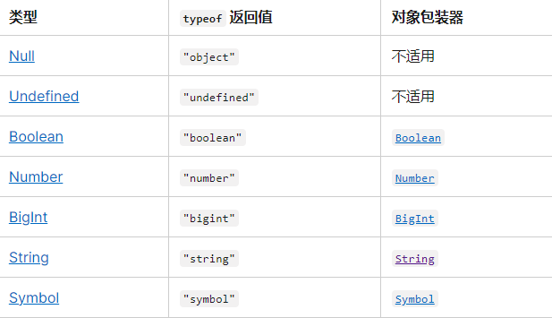
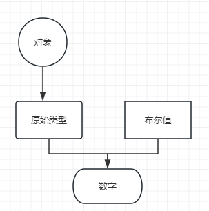

# JavaScript 数据结构

## 原始值



## 如何判断==的相等性

相等性比较小技巧



### 数据类型转换规则

当其中一方是 null 或者 undefind 的时候， 另一方必须是 null 或者 undefind ，不会进行类型转换

```javascript
null == undefind; // true
```

对象转原始类型会一次调用 Symbol.toPrimitive valueof toString

{} 转为原始值 .valueof {} .toString ===>"[Object object]" ===> NaN

[] 转为原始值 ====> "" ========> 0

-   如果它们是相同类型的，则进行同类型比较。
-   如果操作数中有一个是 Symbol，但另一个不是，则返回 `false`。
-   如果操作数之一是 Boolean，而另一个不是，[则将 Boolean 转换为 Number](https://developer.mozilla.org/zh-CN/docs/Web/JavaScript/Reference/Global_Objects/Number#number_%E5%BC%BA%E5%88%B6%E8%BD%AC%E6%8D%A2)：`true` 转换为 1，`false` 转换为 0。然后再次对两个操作数进行宽松比较。
-   Number 转 String：[将 String 转换为 Number](https://developer.mozilla.org/zh-CN/docs/Web/JavaScript/Reference/Global_Objects/Number#number_%E5%BC%BA%E5%88%B6%E8%BD%AC%E6%8D%A2)。转换失败会得到 `NaN`，这将确保相等性为 `false`。
-   Number 转 BigInt：按照其数值进行比较。如果 Number 是 `±Infinity` 或 `NaN`，返回 `false`。
-   String 转 BigInt: 使用与 [`BigInt()`](https://developer.mozilla.org/zh-CN/docs/Web/JavaScript/Reference/Global_Objects/BigInt/BigInt) 构造函数相同的算法将字符串转换为 BigInt。如果转换失败，则返回 `false`。
